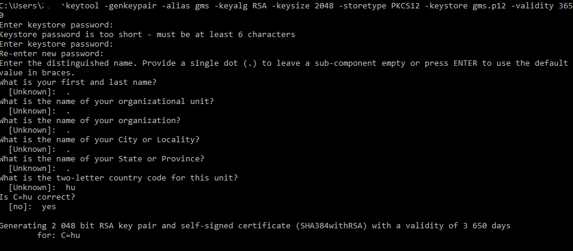

# Give My Secret configuration examples

Here are some samples how you can configure Give My Secret with numerous databases and authentication providers.

# Use case 1: PostgreSQL with database authentication

Prerequisite:

- Preconfigure a self-signed keystore (<u>details can be found in "HTTPS Configuration" section!</u>)
- A running PostgreSQL database instance (sample configuration can be found [**HERE**](../db/postgresql/README.md))

In order to run a GMS instance with PostgresSQL and db based authentication, you can use the preconfigured

- [env file](db-authentication/env-postgresql.txt),
- [Docker compose file](db-authentication/docker-compose.yml),
- [Windows batch file](db-authentication/compose-app-postgresql-standalone.bat)

that you can find in the [db-authentication](db-authentication/) folder.

# Use case 2: PostgreSQL with LDAP authentication

Prerequisite:

- Preconfigure a self-signed keystore (<u>details can be found in "HTTPS Configuration" section!</u>)
- A running PostgreSQL database instance (sample configuration can be found [**HERE**](../db/postgresql/README.md))

In order to run a GMS instance with PostgresSQL and LDAP based authentication, you can use the preconfigured

- [env file](ldap-authentication/env-postgresql-and-ldap.txt),
- [Docker compose file](ldap-authentication/docker-compose.yml),
- [Windows batch file](ldap-authentication/compose-app-postgresql-and-ldap.bat)

that you can find in the [ldap-authentication](ldap-authentication/) folder.

# Use case 3: Keycloak SSO authentication with PostgreSQL database

Prerequisite:

- Preconfigure a self-signed keystore (<u>details can be found in "HTTPS Configuration" section!</u>)
- A running PostgreSQL database instance (sample configuration can be found [**HERE**](../db/postgresql/README.md))

TODO

# Use case 4: ELK stack configuration

Please read the separate **[guide](elk-sample-configuration/README.md)** how to configure an ELK stack for Give My Secret application!

# Use case N+1: Setting up with Kubernetes on Windows

Prerequisite:

- Preconfigure a self-signed keystore (<u>details can be found in "HTTPS Configuration" section!</u>)
- A running PostgreSQL database instance (sample configuration can be found [**HERE**](../db/postgresql/README.md))

TODO

# HTTPS Configuration

To make the application HTTPS ready, you need a keystore that will be loaded by the application. To create a new one, run the following command:

> keytool -genkeypair -alias gms -keyalg RSA -keysize 2048 -storetype PKCS12 -keystore gms.p12 -validity 3650

You need to enter a keystore password, and a few more additional parameters:

With this command you generated a self-signed certificate that will be valid for 10 years.

To use the keystore, you have to configure it with a few environment properties (you can find a sample in all batch file configurations).

> SSL_KEYSTORE_TYPE=PKCS12
> SSL_KEYSTORE_PATH=/usr/share/ssl/
> SSL_KEYSTORE=${SSL_KEYSTORE_PATH}test.p12
> SSL_KEYSTORE_PASSWORD=$your_password$
> SSL_KEYSTORE_ALIAS=$alias$
