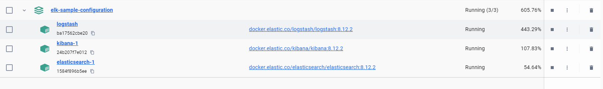

# ELK stack example setup

The purpose of this guide is to provide an example to setup your on ELK stack on your machine. I'd like to emphasyze, this solution is **unsecure**, so please use it only for local development and/or testing purposes, because __<u>it does not contain any security configuration</u>__! If you need a secure, cert-based sample configuration, please take a look at reference [1].

# Content

- **.env**: The Docker environment file that contains some major environment parameters,
- **elk-docker-compose.yml**: Compose file that needs to be used to utilize the setup,
- **logstash.conf:** Logstash configuration file. Feel free to customize it with filters, etc.,
- **start-containers.bat/sh**: Use these scripts to start the Docker container initialization.

**IMPORTANT: Logstash and Kibana will start only if ElasticSearch is up and running!**

# Settings in GMS

In order to send logs to Logstash, you have to configure some additional system properties to your GMS instance:

- LOG_TYPE=logstash
- LOGSTASH_URL=http://localhost:5000

# Resources

- [1] https://www.elastic.co/guide/en/elasticsearch/reference/current/docker.html#docker-compose-file
