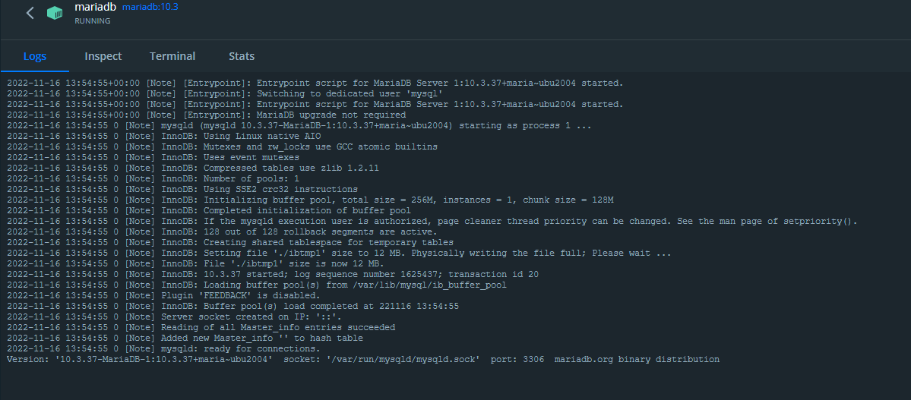
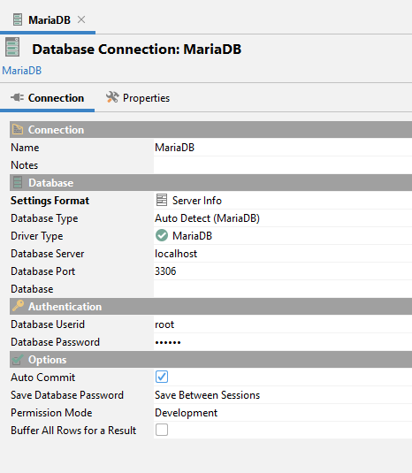
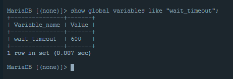

# Maria DB Configuration

The easiest way to set up your own Maria DB instance is to pull a Docker image. You can find the official Docker configuration here: https://hub.docker.com/_/mariadb 

Download a Docker image version by running the following or a similar command:

> docker pull mariadb:10.3

then run it:

> docker run -p 3306:3306 --name mariadb --env MARIADB_DATABASE=gms --env MARIADB_ROOT_PASSWORD=Secret -d mariadb:10.3 --lower_case_table_names=1

If everything goes fine, you can see the following in your Docker client:

then try to connect to the database with your preferred DB client:

# Possible issues

## maxLifeTime

If you see the following or similar in the Docker logs

> WARN  com.zaxxer.hikari.pool.PoolBase.isConnectionAlive - HikariPool-1 - Failed to validate connection org.mariadb.jdbc.Connection@6728ba06 ((conn=26) Connection.setNetworkTimeout cannot be called on a closed connection). Possibly consider using a shorter maxLifetime value.

do the following.

Login into your database, and execute the following command:

> show global variables like "wait_timeout";

You'll see something like this:

****

To fix this, edit the **DB_MAX_LIFETIME** environment property in your Docker compose environment variable and you need to set the value to be several seconds less.
