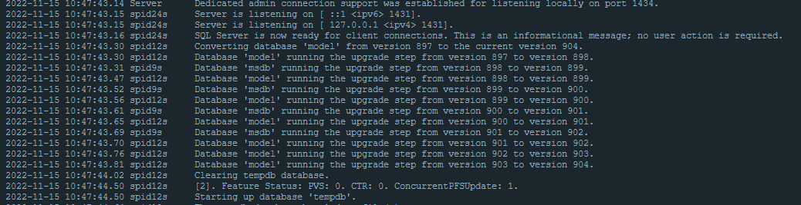
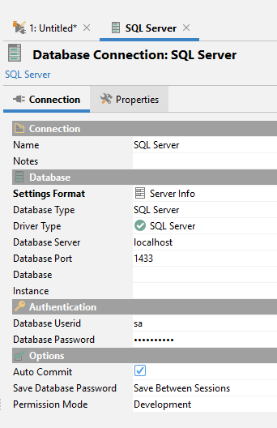

# MS SQL Configuration

The easiest way to set up your own MS SQL instance is to pull a Docker image. You can find the official Docker configuration here: https://hub.docker.com/_/microsoft-mssql-server

Download a Docker image version by running the following or a similar command:

> docker pull mcr.microsoft.com/mssql/server:2019-CU18-ubuntu-20.04

then run it:

> docker run -e "ACCEPT_EULA=Y" -e "MSSQL_SA_PASSWORD=Password1985!" -e "MSSQL_PID=Developer" -p 1433:1433 --name mssql --hostname localhost -d mcr.microsoft.com/mssql/server:2019-CU18-ubuntu-20.04

If everything goes fine, you can see the following in your Docker client:

then try to connect to the database with your preferred DB client:

<mark>Important note: The tables will be created in your default database scheme!</mark>
