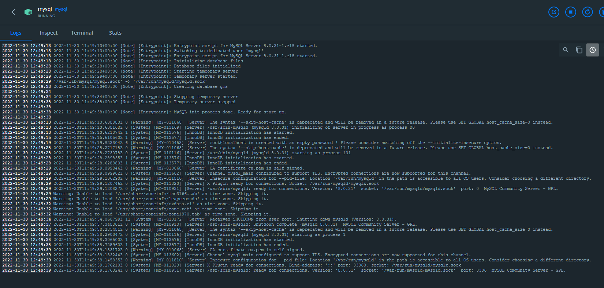

# MySQL Configuration

The easiest way to set up your own MySQL instance is to pull a Docker image. You can find the official Docker configuration here: https://hub.docker.com/_/mysql

Download a Docker image version by running the following or a similar command:

> docker pull mysql

then run it:

> docker run -p 3306:3306 --name mysql -e MYSQL_DATABASE=gms -e MYSQL_ROOT_PASSWORD=Secret -d mysql --lower_case_table_names=1

If everything goes fine, you can see the following in your Docker client:

then try to connect to the database with your preferred DB client.
