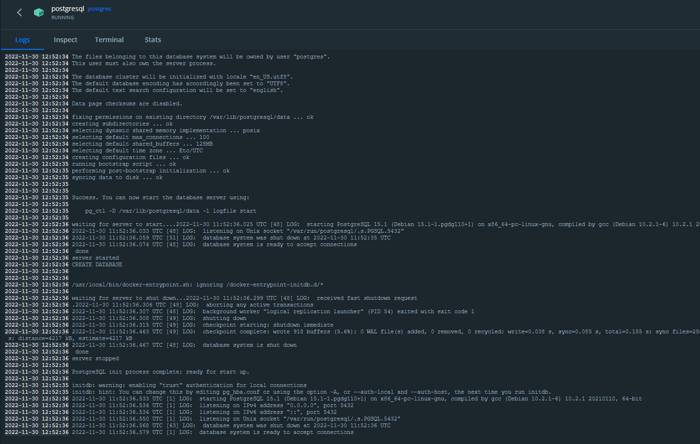

# PostgreSQL Configuration

The easiest way to set up your own PostgreSQL instance is to pull a Docker image. You can find the official Docker configuration here: https://hub.docker.com/_/postgres

Download a Docker image version by running the following or a similar command:

> docker pull postgres

then run it:

> docker run -p 5432:5432 --name postgresql -e POSTGRES_DB=gms -e POSTGRES_PASSWORD=Secret -d postgres

If everything goes fine, you can see the following in your Docker client:

then try to connect to the database with your preferred DB client.
