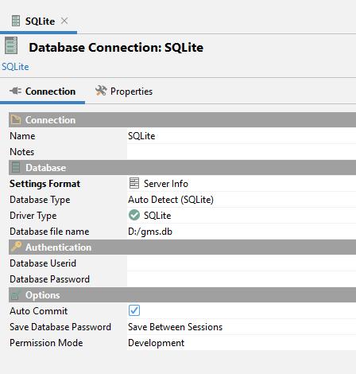

# SQLite Configuration

If you select SQLite as a database to your GMS instance, you don't need to perform any additional steps. The only thing that you need to do is to properly configure the external system properties for the application, especially the following ones:

> ```
> ...
> -DDB_JDBC_URL=jdbc:sqlite:file:/gms.db?cache=shared
> ...
> -DSELECTED_DB=sqlite
> ```

**<u>Important note:</u>**

- Don't forget to check & set the necessary permissions to the folder where you want to place your SQLite database file!

To validate your database has been created successfully, I recommend to use DbVisualizer:




