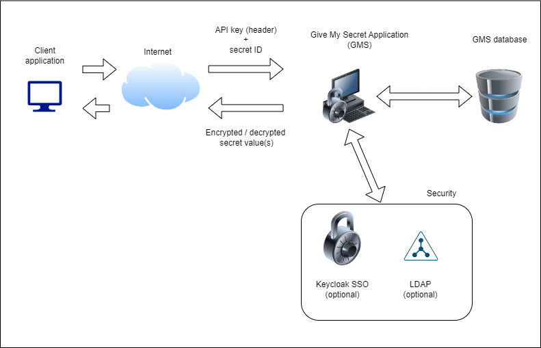

# Give My Secret credential manager application
## What is Give My Secret?
Sometimes your company has a lot of distributed systems that has it's own credentials and it can be exhausting to manage these passwords. Yes, there're a bunch of out-of-the-box solutions, like AWS Secrets Manager, HashiCorp Vault, CyberArk, etc., but sometimes you might need a simpler and smaller solution and you might not want to move to the cloud.

<u>Give My Secret( or GMS) helps you to handle these text based passwords in one, centralized application.</u>  All passwords will be stored in a reliable and secure way, because all credentials will be encrypted (and decrypted) with the keystore that YOU configure and on top of this by default HTTPS is used.

GMS provides a simple REST API that you can call with your other systems to query your secrets.

## Main features
- Text based secret/password/credential storage
- Simple of even complex key/value pairs can be stored
- REST API to query the secrets from your local instance
- 4 supported database providers
  - PostgreSQL, 
  - MSSQL, 
  - MySQL, 
  - MariaDb

- 3 supported authentications
  - DB,
  - LDAP,
  - Keycloak SSO (basic level support)

- 2 supported protocols
  - HTTPS,
  - HTTP

- 2 Factor Authentication support
- Redis cache support
- IP address and API key restriction functionalities
- External and internal system properties to fine tune the application
- Audited functions to browse user events and actions

## Configuration examples
You can find many real life examples [here](usecases.MD).
