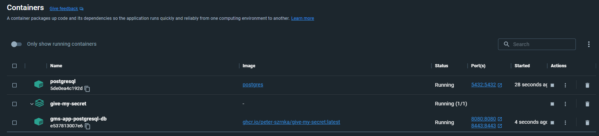

# Introduction
On this page you can read a few use cases how Give My Secret can be configured and used. All keystore related steps are mandatory, these section titles will be marked with a "*".

## Create a Keystore for SSL*
A separate keystore is required to setup a secure, HTTPS based GMS instance.

> keytool -genkeypair -alias gms -keyalg RSA -keysize 2048 -storetype PKCS12 -keystore gms.p12 -validity 3650

## Create a default keystore*
Default keystore is required to encrypt/decrypt some sensitive data stored in database, like the user's aliases and credentials.

## Create a keystore folder*
You have to create a folder( ofc with the right permissions!) to store the keystores uploaded by your users. This folder will be passed to the Docker container as a property, so **no user data will be stored inside the GMS Docker container**.

# DB based authentication with PostgreSQL database + HTTPS protocol
First, download the Docker image:

> docker pull ghcr.io/peter-szrnka/give-my-secret:latest

Download the following files:
- [env-postgresql.txt](https://github.com/peter-szrnka/give-my-secret/blob/main/batch-files/db-authentication/env-postgresql.txt)
- [docker-compose.yml](https://github.com/peter-szrnka/give-my-secret/blob/main/batch-files/db-authentication/docker-compose.yml)

Open a command line and run the following command:

> docker compose --env-file env-postgresql.txt -p give-my-secret up -d

# LDAP based authentication with MySQL database
First, download the Docker image:

> docker pull ghcr.io/peter-szrnka/give-my-secret:latest

Download the following files:
- [env-mysql.txt](https://github.com/peter-szrnka/give-my-secret/blob/main/batch-files/db-authentication/env-mysql.txt)
- [docker-compose.yml](https://github.com/peter-szrnka/give-my-secret/blob/main/batch-files/ldap-authentication/docker-compose.yml)

Open a command line and run the following command:

> docker compose --env-file env-mysql.txt -p give-my-secret up -d

